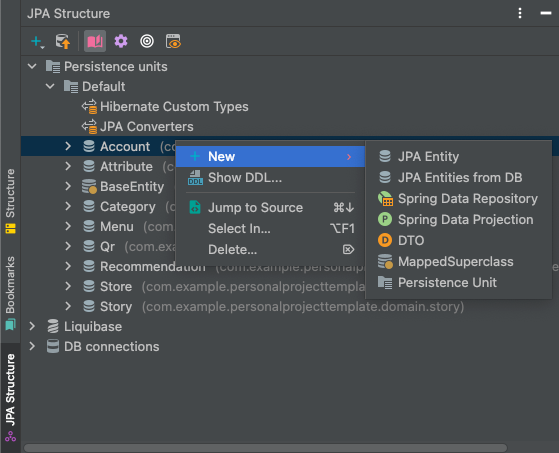
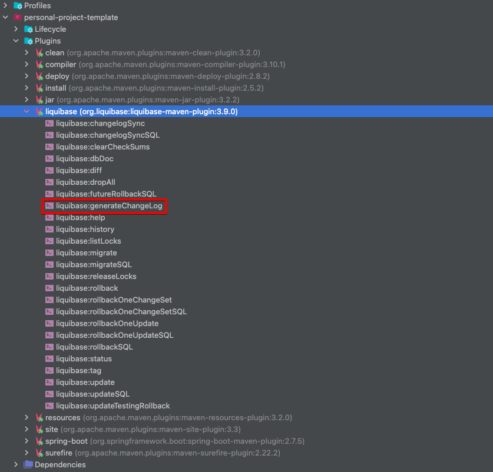

# Spring Boot All In One 
## What is this project? 
This is a basic CRUD template project which include below dependencies: 
- Web
  - spring-boot-starter-web 
  - spring-boot-starter-validation(for validation)
- Data layer: 
  - spring-boot-starter-data-jpa
  - liquibase-core(for database scheme versioning)
  - mysql-connector-j(we use mysql)
  - testcontainers(for test profile only)
- Utility 
  - mapstruct 
  - lombok 
  - commons-io
  - commons-lang3 

## Schema Changes 
- Jpa entity, dto 
  - use JPA Buddy 
  - Use JPA Buddy to create entities/dto/spring data repository 
    - 
- Apply schema changes in liquibase   
  - 
  - 
## Testing 
- In order to use test containers, you should run docker locally 
# spring-boot-skeleton-template
